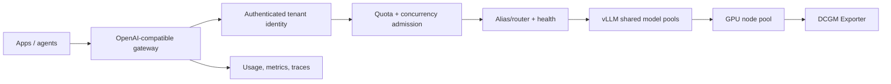

# Multi-Tenant AI Inference Platform

A production-oriented inference-as-a-service platform: OpenAI-compatible requests enter a tenant-aware gateway that authenticates, authorizes, rate-limits, meters, routes, and observes traffic before sending it to model runtimes. It complements [ai-platform-control-plane](https://github.com/Bepoadewale/ai-platform-control-plane): project one governs infrastructure requests; this project governs inference consumption on a shared GPU fleet.



## What runs locally

The gateway, tenant authentication, per-tenant limits, weighted routing, circuit-safe healthy-backend selection, OpenAI-compatible chat/streaming responses, metering, cost estimates, Prometheus metrics, API tests, and benchmark utility run against a deterministic mock backend—no GPU, AWS account, model download, or paid API is required. **It is not an inference performance benchmark.**

```console
make install && make test
make run
curl http://127.0.0.1:8080/v1/chat/completions \
  -H 'Authorization: Bearer local-search-token' -H 'content-type: application/json' \
  -d '{"model":"chat-default","messages":[{"role":"user","content":"hello"}],"max_tokens":32}'
make demo
make load-test
```

`local-search-token` and `local-payments-token` are development fixtures only. Production identity is OIDC/API-key material resolved server-side; tenant headers are never trusted.

## GPU mode

The vLLM and GPU manifests are production-like contracts, not locally validated GPU claims. They use integer `nvidia.com/gpu` scheduling, GPU labels/taints, vLLM serving controls, DCGM telemetry, and KEDA demand metrics. Enable AWS GPU nodes only through reviewed Terraform with `enable_gpu_nodes=true`; GPU costs can be substantial.

## Evidence and documentation

Read [architecture](docs/architecture.md), [multi-tenancy](docs/multi-tenancy.md), [inference performance](docs/inference-performance.md), [GPU scheduling](docs/gpu-scheduling.md), [benchmarking](docs/benchmarking.md), and the [interview guide](docs/interview-guide.md). Capture portfolio screenshots from `/metrics`, Grafana dashboards, benchmark reports, and `kubectl get pods` after `make bootstrap-local`.

Next: run `make test`, explore [demo scenarios](docs/benchmarking.md), or review the [roadmap](docs/roadmap.md).
