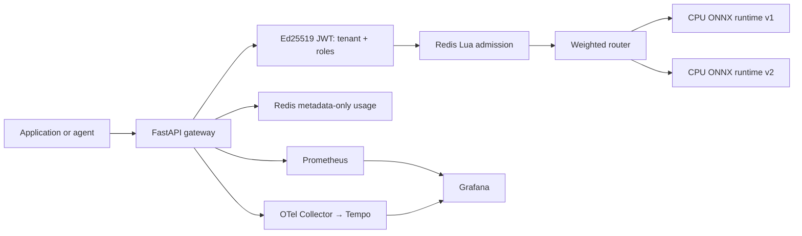

# Multi-Tenant AI Inference Platform

A local-first, governed inference platform for shared AI model capacity. Applications and agents use an OpenAI-compatible API; the gateway verifies a signed identity, derives the tenant server-side, applies shared admission controls, routes to a model runtime, records privacy-safe usage, and emits metrics and traces.

It answers a practical platform question: **how can multiple teams use shared model capacity without receiving direct runtime, GPU, Redis, or infrastructure credentials?**

## What it allows—and prevents

- A signed tenant identity can invoke only its assigned model aliases.
- Two independent gateway processes share Redis-backed request, token, concurrency, daily-budget, and bounded-queue admission.
- A platform administrator can adjust a weighted rollout; ordinary tenants and agents cannot.
- Inference traffic reaches two real local CPU ONNX Runtime targets. Streaming is OpenAI-compatible SSE.
- Usage records contain tenant/model/backend/token/latency metadata, never raw prompts or responses.
- Explicit failures are returned for quota exhaustion, overload, an unavailable backend, and a bounded backend timeout. Requests are not replayed after a backend error.



## Executed local evidence

| Capability | Status | Evidence |
| --- | --- | --- |
| CPU ONNX Runtime inference | ✅ EXECUTED LOCALLY | Two runtime containers return real classifier output through the gateway. |
| Signed identity + tenant RBAC | ✅ EXECUTED LOCALLY | Ed25519 JWT issuer/audience/expiry/signature/tenant/role checks and negative tests. |
| Distributed admission | ✅ EXECUTED LOCALLY | Redis Lua limits shared across two gateways; quota and queue demos return 429. |
| Weighted routing | ✅ EXECUTED LOCALLY | Admin weight change sends live traffic to the candidate runtime. |
| Usage + restart recovery | ✅ EXECUTED LOCALLY | Metadata-only Redis usage survives a gateway restart. |
| Metrics, traces, dashboards | ✅ EXECUTED LOCALLY | Prometheus, OTel Collector, Tempo, and Grafana receive generated local traffic. |
| GPU/vLLM/DCGM/Kubernetes | 📐 ARCHITECTURE / CONTRACT ONLY | No GPU or cloud execution is claimed. |

## Run locally

Prerequisites: Docker Desktop, Docker Compose, Python 3.12, `curl`, and `jq`. No cloud account, GPU, model download, or paid API is required.

```console
make install
make bootstrap-local
make smoke
make demo-local          # real inference, streaming, and shared quota
make demo-overload       # bounded queue reject
make demo-routing        # live candidate routing
make demo-metering       # privacy-safe durable usage
make demo-observability  # Prometheus + Tempo evidence
make demo-failure        # unavailable backend → 502
make demo-timeout        # bounded timeout → 502
make demo-recovery       # gateway restart retains usage
make verify
make clean-local
```

The local stack publishes gateways on `:8081` and `:8082`, Prometheus on `:9090`, Tempo on `:3200`, and Grafana on `:3002`. `make clean-local` removes only this repository's Compose containers, network, volumes, virtual environment, generated ONNX artifact, and generated identity fixture.

## Security boundary

The gateway does not trust tenant headers. Local Compose mode creates an ephemeral Ed25519 key pair and test tokens under ignored `.local/identity/`; the private key stays on the host and is never committed. Gateway containers receive only the public verification key. The local fixture distinguishes `inference.invoke` from `platform.admin`; an agent identity cannot self-escalate to rollout administration.

The CPU runtime is deliberately lightweight and deterministic. It validates control-plane behavior, not model quality, GPU throughput, DCGM telemetry, KV-cache utilization, or production economics.

## Documentation

- [Architecture](docs/architecture.md)
- [Multi-tenancy](docs/multi-tenancy.md)
- [Routing](docs/routing.md)
- [Observability](docs/observability.md)
- [Security](docs/security.md)
- [Failure modes](docs/failure-modes.md)
- [Implementation status](docs/IMPLEMENTATION_STATUS.md)
- [Validation evidence](docs/VALIDATION.md)

See [ai-platform-control-plane](https://github.com/Bepoadewale/ai-platform-control-plane) for governed infrastructure provisioning. This repository governs consumption of shared inference capacity.
