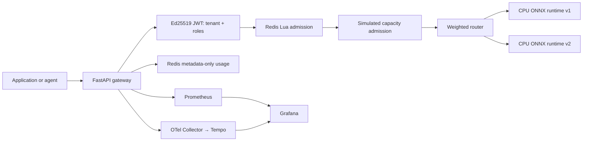

# Multi-Tenant AI Platform

The public flagship for a local-first, governed AI platform. Its executed foundation is
a multi-tenant inference platform: applications and agents use an OpenAI-compatible
API; the gateway verifies a signed identity, derives the tenant server-side, applies
shared admission controls, routes to a model runtime, records privacy-safe usage, and
emits metrics and traces.

It answers a practical platform question: **how can multiple teams use shared model capacity without receiving direct runtime, GPU, Redis, or infrastructure credentials?**

## Flagship direction

The proven inference core stays intact. The platform will add model release control,
simulated-capacity policy, SLO/FinOps evidence, governed remediation, secure agent
tools, optional edge operations and developer self-service as **separate validated
vertical slices**—not as a rewrite or a merge of nine codebases.

The current integrated demonstration is:

```text
tenant request -> identity/quota/capacity policy -> verified candidate release
-> shared canary traffic -> trace + local SLO + estimated cost evidence
-> independent approval -> promote or roll back
```

The remediation slice extends that path only after evidence exists:

```text
failed candidate canary request -> durable incident -> immutable rollback plan
-> independent remediation approval -> exact rollout precondition -> stable-only routing
-> live ONNX verification -> durable audit timeline
```

See [flagship direction](docs/flagship-direction.md) for boundaries and the staged
integration model. Commercial strategy is intentionally not maintained in this public
repository.

## What it allows—and prevents

- A signed tenant identity can invoke only its assigned model aliases.
- Two independent gateway processes share Redis-backed request, token, concurrency, daily-budget, and bounded-queue admission.
- A model can require simulated shared accelerator capacity, queue briefly for it, be rejected at a tenant bound, or use an explicitly permitted CPU fallback. This is Redis quota accounting only; inference remains real CPU ONNX Runtime.
- A platform administrator can adjust a weighted rollout; ordinary tenants and agents cannot.
- Inference traffic reaches two real local CPU ONNX Runtime targets. Streaming is OpenAI-compatible SSE.
- Usage records contain tenant/model/backend/token/latency metadata, never raw prompts or responses.
- A platform administrator can retrieve metadata-only evidence for one completed request: its Tempo trace ID, route/version, active release plan, local fixture SLO result, and versioned estimated token cost.
- A remediation controller can act only on an observed failed `chat-default` **canary** request. Its sole allowlisted action is restoring the previously verified stable ONNX target; it cannot run shell commands, alter arbitrary routing, call Kubernetes, or access cloud credentials.
- The remediation requester cannot approve its own plan. Execution re-reads Redis rollout context and the SQLite release state, rejects a stale plan, applies cooldown/action-budget guards, verifies stable inference, and persists the incident/plan/audit timeline.
- Explicit failures are returned for quota exhaustion, overload, an unavailable backend, and a bounded backend timeout. Requests are not replayed after a backend error.


```mermaid
flowchart LR
  A[Application or agent] --> G[FastAPI gateway]
  G --> J[Ed25519 JWT: tenant + roles]
  J --> R[Redis Lua admission]
  R --> C[Simulated capacity admission]
  C --> W[Weighted router]
  W --> O1[CPU ONNX runtime v1]
  W --> O2[CPU ONNX runtime v2]
  G --> U[Redis metadata-only usage]
  G --> P[Prometheus]
  G --> T[OTel Collector → Tempo]
  P --> D[Grafana]
  T --> D
```

## Executed local evidence

| Capability | Status | Evidence |
| --- | --- | --- |
| CPU ONNX Runtime inference | ✅ EXECUTED LOCALLY | Two runtime containers return real classifier output through the gateway. |
| Signed identity + tenant RBAC | ✅ EXECUTED LOCALLY | Ed25519 JWT issuer/audience/expiry/signature/tenant/role checks and negative tests. |
| Distributed admission | ✅ EXECUTED LOCALLY | Redis Lua limits shared across two gateways; quota and queue demos return 429. |
| Simulated accelerator capacity policy | ✅ EXECUTED LOCALLY | Shared Redis capacity accounting admits, queues, rejects tenant overuse, and allows an explicit CPU fallback while requests still execute on real CPU ONNX. |
| Weighted routing | ✅ EXECUTED LOCALLY | Admin weight change sends live traffic to the candidate runtime. |
| MLflow model registry | ✅ EXECUTED LOCALLY | Local MLflow records two real ONNX artifacts, SHA-256 digests, fixture evaluation metrics, and `champion`/`candidate` aliases. |
| Governed model release | ✅ EXECUTED LOCALLY | SQLite plans bind MLflow aliases/digests; separate roles prove approval, shared canary, promotion, stale-state rejection, and rollback. |
| Request operational evidence | ✅ EXECUTED LOCALLY | A real canary request correlates a Tempo trace ID, release plan, target version, local request SLO, and Decimal-calculated fixture token estimate; an actual backend timeout persists as an SLO violation. |
| Governed canary remediation | ✅ EXECUTED LOCALLY | A failed candidate canary request creates a durable SQLite incident; separate approval, exact-state protection, bounded stable rollback, restart recovery, audit, Prometheus metrics, and live ONNX verification run locally. |
| Usage + restart recovery | ✅ EXECUTED LOCALLY | Metadata-only Redis usage survives a gateway restart. |
| Metrics, traces, dashboards | ✅ EXECUTED LOCALLY | Prometheus, OTel Collector, Tempo, and Grafana receive generated local traffic. |
| Physical GPU/vLLM/DCGM/Kubernetes | 📐 ARCHITECTURE / CONTRACT ONLY | Simulated capacity is not physical accelerator scheduling; no GPU or cloud execution is claimed. |

## Run locally

Prerequisites: Docker Desktop, Docker Compose, Python 3.12, `curl`, and `jq`. No cloud account, GPU, model download, or paid API is required.

```console
make install
make bootstrap-local
make smoke
make status              # service readiness and recorded request count
make demo-local          # real inference, streaming, and shared quota
make demo-overload       # bounded queue reject
make demo-routing        # live candidate routing
make demo-model-registry # MLflow artifact, digest, evaluation and alias evidence
make demo-release-control # plan → independent approval → canary → promote → rollback
make demo-capacity       # simulated accelerator admission, queue, reject, and CPU fallback
make demo-operational-evidence # canary request → Tempo trace/release/SLO/estimated cost + timeout SLO violation
make demo-remediation # failed canary → incident → independent approval → stable rollback → verified recovery
make demo-metering       # privacy-safe durable usage
make demo-observability  # Prometheus + Tempo evidence
make demo-failure        # unavailable backend → 502
make demo-timeout        # bounded timeout → 502
make demo-recovery       # gateway restart retains usage
make verify
make clean-local
```

The local stack publishes gateways on `:8081` and `:8082`, release control on `:8083`, remediation control on `:8084`, MLflow on `:15010`, Prometheus on `:9090`, Tempo on `:3200`, and Grafana on `:3002`. `make clean-local` removes only this repository's Compose containers, network, volumes, virtual environment, generated ONNX artifacts, MLflow/release/remediation state, and generated identity fixture.

## Security boundary

The gateway does not trust tenant headers. Local Compose mode creates an ephemeral Ed25519 key pair and test tokens under ignored `.local/identity/`; the private key stays on the host and is never committed. Gateway containers receive only the public verification key. The local fixture distinguishes `inference.invoke`, `platform.admin`, and `release.approve`; a requester cannot approve their own release plan, and an agent identity cannot self-escalate to rollout administration.

The CPU runtime is deliberately lightweight and deterministic. It validates control-plane behavior, not model quality, GPU throughput, DCGM telemetry, KV-cache utilization, or production economics.

## Operational evidence boundary

`GET /platform/v1/requests/{request_id}/analysis` is restricted to the local
`platform.admin` role. It reads a seven-day, Redis-backed metadata record—tenant,
model, deployment version, release-plan context, token totals, outcome and trace ID.
It never stores prompt or completion text. The SLO thresholds are local fixture
thresholds; the cost uses a versioned Decimal token-price fixture and is explicitly
**not** cloud billing, an invoice, or a physical-GPU allocation.

## Governed remediation boundary

Remediation is intentionally not an autonomous infrastructure administrator. The
separate controller accepts only a request ID for a recorded `backend_error` during an
active `chat-default` canary. It produces a SHA-256-bound plan for the single
`ROLLBACK_CANARY_TO_STABLE` action, requires a distinct `remediation.approve` identity,
and rechecks the precise Redis rollout weights, release-plan ID, release phase, and
SQLite release status immediately before writing stable-only weights. A stale plan is
rejected. A per-model cooldown and action budget prevent retry loops. The controller
then verifies both rollout state and a real post-action ONNX request. It does **not**
receive generic shell, Docker, Kubernetes, cloud, model-registry, or tenant-inference
authority.

## Documentation

- [Architecture](docs/architecture.md)
- [Flagship direction](docs/flagship-direction.md)
- [Multi-tenancy](docs/multi-tenancy.md)
- [Routing](docs/routing.md)
- [Observability](docs/observability.md)
- [FinOps](docs/finops.md)
- [Security](docs/security.md)
- [Failure modes](docs/failure-modes.md)
- [Implementation status](docs/IMPLEMENTATION_STATUS.md)
- [Validation evidence](docs/VALIDATION.md)

See [ai-platform-control-plane](https://github.com/Bepoadewale/ai-platform-control-plane) for governed infrastructure provisioning. This repository governs consumption of shared inference capacity.
