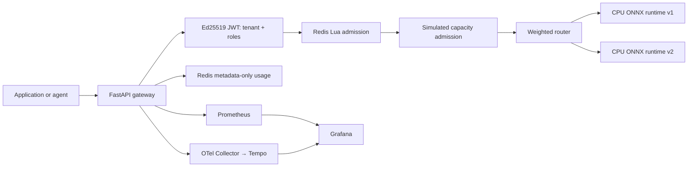

# Multi-Tenant AI Platform

The public flagship for a local-first, governed AI platform. Its executed foundation is
a multi-tenant inference platform: applications and agents use an OpenAI-compatible
API; the gateway verifies a signed identity, derives the tenant server-side, applies
shared admission controls, routes to a model runtime, records privacy-safe usage, and
emits metrics and traces.

It answers a practical platform question: **how can multiple teams use shared model capacity without receiving direct runtime, GPU, Redis, or infrastructure credentials?**

## Flagship direction

The proven inference core stays intact. The platform adds model release control,
simulated-capacity policy, SLO/FinOps evidence, governed remediation, secure agent
tools, developer self-service, a narrow edge-routing adapter, and bounded sandboxed
agent execution as **separate
validated vertical slices**—not as a rewrite or a merge of nine codebases.

The current integrated demonstration is:

```text
tenant request -> identity/quota/capacity policy -> verified candidate release
-> shared canary traffic -> trace + local SLO + estimated cost evidence
-> independent approval -> promote or roll back
```

Run the complete local proof with `make demo-flagship` after `make bootstrap-local`.
It executes the preserved inference path and each integrated slice's success and
failure assertions against one live Compose stack; `make clean-local` removes only
resources owned by this project. Two clean-room cycles of that workflow are recorded
in [validation evidence](docs/governance/VALIDATION.md).

The remediation slice extends that path only after evidence exists:

```text
failed candidate canary request -> durable incident -> immutable rollback plan
-> independent remediation approval -> exact rollout precondition -> stable-only routing
-> live ONNX verification -> durable audit timeline
```

The delegated-agent slice adds a deliberately narrow HTTP tool facade. It is not an
MCP implementation: the separately validated `secure-mcp-infrastructure-gateway`
remains the portfolio's protocol-level MCP reference. Here, an Ed25519-signed agent
identity can discover only metadata evidence and canary-plan preparation for its own
tenant; it cannot approve, execute, promote, change routing, or obtain infrastructure
credentials.

The developer-self-service slice adds the narrow contract that a developer portal or
golden-path template would call. A signed human developer can create a durable,
tenant-bound inference integration profile for an assigned model. The profile returns
token-free starter files and the approved API/model contract; it does not return a
tenant header, runtime/Redis credential, rollout control, or platform-admin authority.
Delegated agents cannot create these profiles.

The edge slice is intentionally an adapter, not a second fleet platform. Two
independent simulated device-agent containers register signed device identities with a
durable edge-control service. A compatible device executes local CPU ONNX; a
constrained device uses the central gateway only for public traffic. Restricted or
`LOCAL_ONLY` traffic with no local model is denied rather than silently leaving the
device boundary. Hardware labels are simulated; the processes, signing, local ONNX,
routing, and restart recovery are real local behavior.

The sandbox slice is a bounded task contract, not unrestricted agent shell access. A
short-lived delegated agent can request only named fixture tasks. A trusted controller
creates a disposable child container that is non-root, read-only, capability-dropped,
network-isolated, resource-limited, and denied both Docker socket and host bind mounts.

The operator-console slice brings the executed local services into one browser control
surface at **http://localhost:8091**. It shows tenant admission, simulated capacity,
MLflow models, release plans, incidents, delegated-tool permissions and audit, sandbox
tasks, developer integrations, and edge inventory. Its guided forms and buttons forward
only existing scoped release, remediation, developer-profile, sandbox, and explicitly
simulated edge-network actions through the local BFF; it does not add an unrestricted
orchestration backdoor. The local console uses synthetic server-side fixture identities
and is not a claim of production web SSO.

See [flagship direction](docs/architecture/flagship-direction.md) for boundaries and the staged
integration model. Commercial strategy is intentionally not maintained in this public
repository.

## What it allows—and prevents

- A signed tenant identity can invoke only its assigned model aliases.
- Two independent gateway processes share Redis-backed request, token, concurrency, daily-budget, and bounded-queue admission.
- A model can require simulated shared accelerator capacity, queue briefly for it, be rejected at a tenant bound, or use an explicitly permitted CPU fallback. This is Redis quota accounting only; inference remains real CPU ONNX Runtime.
- A platform administrator can adjust a weighted rollout; ordinary tenants and agents cannot.
- Inference traffic reaches two real local CPU ONNX Runtime targets. Streaming is OpenAI-compatible SSE.
- Usage records contain tenant/model/backend/token/latency metadata, never raw prompts or responses.
- A platform administrator can retrieve metadata-only evidence for one completed request: its Tempo trace ID, route/version, active release plan, local fixture SLO result, and versioned estimated token cost.
- A remediation controller can act only on an observed failed `chat-default` **canary** request. Its sole allowlisted action is restoring the previously verified stable ONNX target; it cannot run shell commands, alter arbitrary routing, call Kubernetes, or access cloud credentials.
- The remediation requester cannot approve its own plan. Execution re-reads Redis rollout context and the SQLite release state, rejects a stale plan, applies cooldown/action-budget guards, verifies stable inference, and persists the incident/plan/audit timeline.
- A delegated agent can discover only `get_request_evidence` and `plan_canary_rollback` when its short-lived token includes the matching scopes. Tool discovery omits approval and execution; evidence is tenant-bound and metadata-only; every call is durably audited by an argument hash rather than raw tool arguments.
- A human developer with `developer.self_service` can generate a tenant-bound
  integration profile only for an assigned alias. The profile is idempotent and
  durable, produces token-free client/config/documentation files, and can be read only
  by the same tenant. It cannot be created by a delegated agent.
- Two independent edge-device identities register and heartbeat into a durable local
  inventory. A compatible profile executes local ONNX; a constrained profile has no
  local model and may fall back only for public traffic. Hardware is simulated.
- A delegated sandbox agent can request only named fixture tasks. It cannot supply an
  arbitrary command, select an image/network, mount a host path, access a child Docker
  socket, approve a release, or invoke remediation execution.
- Explicit failures are returned for quota exhaustion, overload, an unavailable backend, and a bounded backend timeout. Requests are not replayed after a backend error.


```mermaid
flowchart LR
  A[Application or agent] --> G[FastAPI gateway]
  G --> J[Ed25519 JWT: tenant + roles]
  J --> R[Redis Lua admission]
  R --> C[Simulated capacity admission]
  C --> W[Weighted router]
  W --> O1[CPU ONNX runtime v1]
  W --> O2[CPU ONNX runtime v2]
  G --> U[Redis metadata-only usage]
  G --> P[Prometheus]
  G --> T[OTel Collector → Tempo]
  P --> D[Grafana]
  T --> D
```

## Executed local evidence

| Capability | Status | Evidence |
| --- | --- | --- |
| CPU ONNX Runtime inference | ✅ EXECUTED LOCALLY | Two runtime containers return real classifier output through the gateway. |
| Signed identity + tenant RBAC | ✅ EXECUTED LOCALLY | Ed25519 JWT issuer/audience/expiry/signature/tenant/role checks and negative tests. |
| Distributed admission | ✅ EXECUTED LOCALLY | Redis Lua limits shared across two gateways; quota and queue demos return 429. |
| Simulated accelerator capacity policy | ✅ EXECUTED LOCALLY | Shared Redis capacity accounting admits, queues, rejects tenant overuse, and allows an explicit CPU fallback while requests still execute on real CPU ONNX. |
| Weighted routing | ✅ EXECUTED LOCALLY | Admin weight change sends live traffic to the candidate runtime. |
| MLflow model registry | ✅ EXECUTED LOCALLY | Local MLflow records two real ONNX artifacts, SHA-256 digests, fixture evaluation metrics, and `champion`/`candidate` aliases. |
| Governed model release | ✅ EXECUTED LOCALLY | SQLite plans bind MLflow aliases/digests; separate roles prove approval, shared canary, promotion, stale-state rejection, and rollback. |
| Request operational evidence | ✅ EXECUTED LOCALLY | A real canary request correlates a Tempo trace ID, release plan, target version, local request SLO, and Decimal-calculated fixture token estimate; an actual backend timeout persists as an SLO violation. |
| Governed canary remediation | ✅ EXECUTED LOCALLY | A failed candidate canary request creates a durable SQLite incident; separate approval, exact-state protection, bounded stable rollback, restart recovery, audit, Prometheus metrics, and live ONNX verification run locally. |
| Delegated agent-tool governance | ✅ EXECUTED LOCALLY | A short-lived Ed25519 agent identity receives filtered discovery, same-tenant metadata evidence, cross-tenant denial, plan-only canary rollback authority, durable audit, and no approval/execution privilege. This is an HTTP facade, not an MCP protocol claim. |
| Developer self-service golden path | ✅ EXECUTED LOCALLY | Separate self-service API creates a durable tenant-bound model-integration profile and token-free starter artifacts. The generated client executes a real ONNX request; unauthorized model, tenant, and agent attempts are denied. |
| Narrow edge routing adapter | ✅ EXECUTED LOCALLY | Two independent edge-agent containers register signed device identities with SQLite control state. Compatible requests use local CPU ONNX; constrained-device public requests use the gateway; restricted and `LOCAL_ONLY` fallback is denied; inventory survives control restart. |
| Bounded sandboxed agent execution | ✅ EXECUTED LOCALLY | A short-lived signed agent invokes only named fixture tasks. A trusted controller creates disposable hardened Docker children; real fixture tests/patching and an outbound-network probe run, arbitrary command input is rejected, child resources are removed, and SQLite audit survives restart. |
| Unified operator console foundation | ✅ EXECUTED LOCALLY | Local browser console aggregates cross-slice evidence and forwards only fixed release/sandbox actions; fixture identities remain server-side. |
| Operator-console drill-down views | ✅ EXECUTED LOCALLY | Linked tenant, model/release, incident, agent/sandbox, developer, and edge detail views are served from the packaged BFF image. Model pages use fixed Prometheus queries for request, latency, token, SLO, release-phase, and estimated fixture-cost evidence, and link to model-filtered Grafana. Two dedicated clean-room cycles are recorded in validation evidence. |
| Usage + restart recovery | ✅ EXECUTED LOCALLY | Metadata-only Redis usage survives a gateway restart. |
| Metrics, traces, dashboards | ✅ EXECUTED LOCALLY | Prometheus, OTel Collector, Tempo, and Grafana receive generated local traffic. |
| Physical GPU/vLLM/DCGM/Kubernetes | 📐 ARCHITECTURE / CONTRACT ONLY | Simulated capacity is not physical accelerator scheduling; no GPU or cloud execution is claimed. |

## Run locally

Prerequisites: Docker Desktop, Docker Compose, Python 3.12, `curl`, and `jq`. No cloud account, GPU, model download, or paid API is required.

```console
make install
make bootstrap-local
make smoke
make status              # service readiness and recorded request count
make demo-local          # real inference, streaming, and shared quota
make demo-overload       # bounded queue reject
make demo-routing        # live candidate routing
make demo-model-registry # MLflow artifact, digest, evaluation and alias evidence
make demo-release-control # plan → independent approval → canary → promote → rollback
make demo-capacity       # simulated accelerator admission, queue, reject, and CPU fallback
make demo-operational-evidence # canary request → Tempo trace/release/SLO/estimated cost + timeout SLO violation
make demo-remediation # failed canary → incident → independent approval → stable rollback → verified recovery
make demo-agent-tools # filtered agent tools → tenant evidence → denied cross-tenant read → plan-only rollback → human approval
make demo-self-service # signed developer → durable integration profile → generated token-free client → real ONNX request
make demo-edge-adapter # registered local device ONNX → constrained public fallback → privacy/LOCAL_ONLY denial → durable inventory restart
make demo-sandboxed-agent # delegated agent → hardened disposable task → patch + blocked egress probe → cleanup + audit restart
make demo-operator-console # routed tenant/model/agent evidence → scoped release actions + named sandbox task
make demo-flagship # cumulative cross-slice scenario used by the operator console
make public-demo # bootstrap + flagship scenario + temporary public Cloudflare Quick Tunnel URL
make demo-metering       # privacy-safe durable usage
make demo-observability  # Prometheus + Tempo evidence
make demo-failure        # unavailable backend → 502
make demo-timeout        # bounded timeout → 502
make demo-recovery       # gateway restart retains usage
make verify
make clean-local
```

The local stack publishes gateways on `:8081` and `:8082`, release control on `:8083`, remediation control on `:8084`, delegated agent tools on `:8085`, developer self-service on `:8086`, edge control on `:8087`, edge devices on `:8088` and `:8089`, sandbox control on `:8090`, the operator console on `:8091`, MLflow on `:15010`, Prometheus on `:9090`, Tempo on `:3200`, and Grafana on `:3002`. `make clean-local` removes only this repository's Compose resources, locally built images, generated artifacts, and local state.

`make public-demo` is a controlled walkthrough helper. It installs `cloudflared` with
Homebrew when necessary, starts the local stack, runs the flagship demo, creates a
temporary public Cloudflare Quick Tunnel, and prints its URL. The URL is public and
short-lived; it is not hosted deployment, does not use a named tunnel or credentials,
and must never be recorded in repository documentation. `Ctrl-C` stops only the
tunnel; use `make clean-local` to remove the local platform afterward. See the
[real-workload pilot guide](docs/delivery/real-workload-pilot.md) for the future,
Terraform-managed deployment path.

## Security boundary

The gateway does not trust tenant headers. Local Compose mode creates an ephemeral Ed25519 key pair and test tokens under ignored `.local/identity/`; the private key stays on the host and is never committed. Gateway containers receive only the public verification key. The local fixture distinguishes `inference.invoke`, `platform.admin`, and `release.approve`; a requester cannot approve their own release plan, and an agent identity cannot self-escalate to rollout administration.

The CPU runtime is deliberately lightweight and deterministic. It validates control-plane behavior, not model quality, GPU throughput, DCGM telemetry, KV-cache utilization, or production economics.

## Operational evidence boundary

`GET /platform/v1/requests/{request_id}/analysis` is restricted to the local
`platform.admin` role. It reads a seven-day, Redis-backed metadata record—tenant,
model, deployment version, release-plan context, token totals, outcome and trace ID.
It never stores prompt or completion text. The SLO thresholds are local fixture
thresholds; the cost uses a versioned Decimal token-price fixture and is explicitly
**not** cloud billing, an invoice, or a physical-GPU allocation.

## Governed remediation boundary

Remediation is intentionally not an autonomous infrastructure administrator. The
separate controller accepts only a request ID for a recorded `backend_error` during an
active `chat-default` canary. It produces a SHA-256-bound plan for the single
`ROLLBACK_CANARY_TO_STABLE` action, requires a distinct `remediation.approve` identity,
and rechecks the precise Redis rollout weights, release-plan ID, release phase, and
SQLite release status immediately before writing stable-only weights. A stale plan is
rejected. A per-model cooldown and action budget prevent retry loops. The controller
then verifies both rollout state and a real post-action ONNX request. It does **not**
receive generic shell, Docker, Kubernetes, cloud, model-registry, or tenant-inference
authority.

## Delegated agent-tool boundary

The `agent-tools` service is intentionally a narrow facade rather than a general
agent-admin API. Its local agent JWT has `principal_type=agent`, a named human
delegator, a five-minute expiry, the `agent.tools` role, and only `inference.read` and
`remediation.plan` scopes. It can read evidence only for `team-search` and create one
immutable canary rollback plan from a recorded failed request. A distinct
`remediation.approve` identity and a `platform.admin` identity remain necessary to
approve and execute that plan. `tools/list` does not reveal privileged operations.
The persistent tool audit stores actor, tenant, tool, timestamp and SHA-256 argument
hash—never raw prompts, responses, tokens or arguments.

## Developer self-service boundary

`developer-self-service` is not a portal rewrite and is not a source of privileged
credentials. It is the small service/request contract an Internal Developer Platform
can call. A signed non-agent principal with `developer.self_service` creates a profile
for only its server-derived tenant and assigned model alias. The response includes an
idempotent, SQLite-persisted integration record plus starter `README`, configuration,
and Python client files. Those artifacts require `INFERENCE_API_TOKEN` only at runtime;
they contain no bearer token, tenant override header, Redis/runtime access, or rollout
authority. Reads are tenant-isolated, unassigned aliases are denied, and an agent
identity is denied before profile creation.

## Documentation

- [Flagship system map, APIs, and admission decisions](docs/architecture/flagship-system-map.md)
- [Operator Console walkthrough and real local screenshots](docs/operations/operator-console.md)
- [Model artifact/release contract](docs/delivery/model-rollouts.md)
- [Local versus production/pilot readiness](docs/delivery/real-workload-pilot.md)
- [Security architecture and threat controls](docs/security/security.md)
- [Runnable API examples](examples/README.md)
- [Documentation index](docs/README.md)
- [Architecture and flagship direction](docs/architecture/)
- [Operations and observability](docs/operations/)
- [Delivery and real-workload pilot](docs/delivery/)
- [Security](docs/security/)
- [Governance and validation](docs/governance/)
- [Interview and roadmap material](docs/portfolio/)

See [ai-platform-control-plane](https://github.com/Bepoadewale/ai-platform-control-plane) for governed infrastructure provisioning. This repository governs consumption of shared inference capacity.
