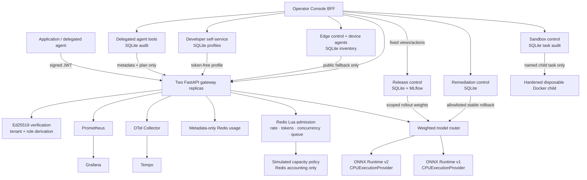

# Flagship system map and API reference

This page maps the **executed local** flagship. It is a system map, not a claim that
every production adapter is deployed. The gateway remains the primary tenant and
admission boundary; vertical slices integrate through scoped HTTP/state contracts.

## Local system map



**Evidence boundary:** `Runtime1` and `Runtime2` execute real local ONNX Runtime CPU
inference. The capacity box is real Redis admission logic but **simulated hardware**;
it is not GPU scheduling, vLLM, DCGM, or performance evidence.

## Repository map

```text
gateway/                 public inference gateway and bounded slice APIs
gateway/src/.../api/     gateway, release, remediation, agent, edge, sandbox, console
operator-console/        restrained browser UI packaged into the console service
scripts/                 reproducible bootstrap, smoke, scenario, cleanup, public demo
platform/                Helm/Kubernetes contracts (not locally deployed)
infrastructure/terraform Terraform-managed future pilot contracts (not applied locally)
models/                  generated local ONNX fixtures; regenerated by make install
examples/                minimal public inference clients
docs/                    evidence, delivery, operations, security, and roadmap material
```

## API quick reference

All inference callers authenticate with `Authorization: Bearer <signed-token>`. Tenant
identity comes from the token—not from a request header.

| Surface | Endpoint | Principal | Purpose | Local evidence |
| --- | --- | --- | --- | --- |
| Inference | `GET /v1/models` | assigned tenant | list allowed aliases | executed |
| Inference | `POST /v1/chat/completions` | assigned tenant | OpenAI-compatible chat/SSE | executed |
| Platform | `GET /platform/v1/usage/{tenant}` | `platform.admin` | metadata-only usage | executed |
| Platform | `GET /platform/v1/requests/{id}/analysis` | `platform.admin` | trace/release/SLO/cost evidence | executed |
| Platform | `GET /platform/v1/capacity` | `platform.admin` | simulated capacity snapshot | executed, simulated hardware |
| Release | `/release/v1/plans/*` | scoped admin/approver | immutable release lifecycle | executed |
| Remediation | `/remediation/v1/*` | scoped requester/approver | incident → bounded rollback | executed |
| Agent tools | `/agent/v1/tools`, `/agent/v1/tools/{name}` | delegated agent | filtered tool discovery/call | executed; HTTP facade, not MCP |
| Developer | `/developer/v1/inference-integrations` | human developer | tenant-bound starter profile | executed |
| Edge | `/edge/v1/devices/*` | device identity | registration/heartbeat/inventory | executed; profiles simulated |
| Sandbox | `/sandbox/v1/tasks` | delegated sandbox agent | named hardened fixture task | executed |
| Console | `/console/v1/*` | local BFF only | fixed views and controls | executed locally |

The versioned APIs above intentionally expose only scoped actions. They do not grant
direct Redis, MLflow, Docker, Kubernetes, cloud, or platform-admin credentials.

## Admission decision table

| Condition | Result | Why |
| --- | --- | --- |
| valid tenant token; assigned model; quota and route healthy | admit | real ONNX request is routed |
| missing/invalid/expired token | `401` | identity fails closed |
| model not assigned to tenant | deny | model authorization is tenant-bound |
| Redis request/token/concurrency budget exhausted | `429` | shared admission is bounded across both gateways |
| bounded queue full | `429` | overload does not become an unbounded wait |
| selected runtime unavailable/too slow | controlled `502` | request is not replayed blindly |
| capacity-required model lacks simulated slot | queue/reject | no silent CPU substitution |
| CPU fallback explicitly allowed | admit to CPU ONNX | policy explicitly permits it |
| edge request is restricted/`LOCAL_ONLY` with no local model | deny | privacy overrides central fallback |

See [failure modes](../operations/failure-modes.md) and the
[local client examples](../../examples/README.md) for exact local walkthroughs.

## Tenant and routing boundary

Tenant identity comes only from an authenticated credential, never a client-supplied
header. Each tenant has assigned aliases plus request/token/concurrency/daily-budget
limits, priority, environment, cost-center, and simulated-capacity allocation. Redis
Lua keeps those limits shared across gateway replicas.

Aliases decouple a client contract from a concrete model version. Admission runs before
routing; a model can require simulated capacity or explicitly allow CPU fallback. The
weighted router selects only healthy targets. If no healthy target exists, it returns a
controlled `503`; a streaming request is never blindly retried after partial output may
have reached the caller. Shared pools optimize utilization, while a future dedicated
pool can trade utilization for stronger isolation and more predictable latency.
