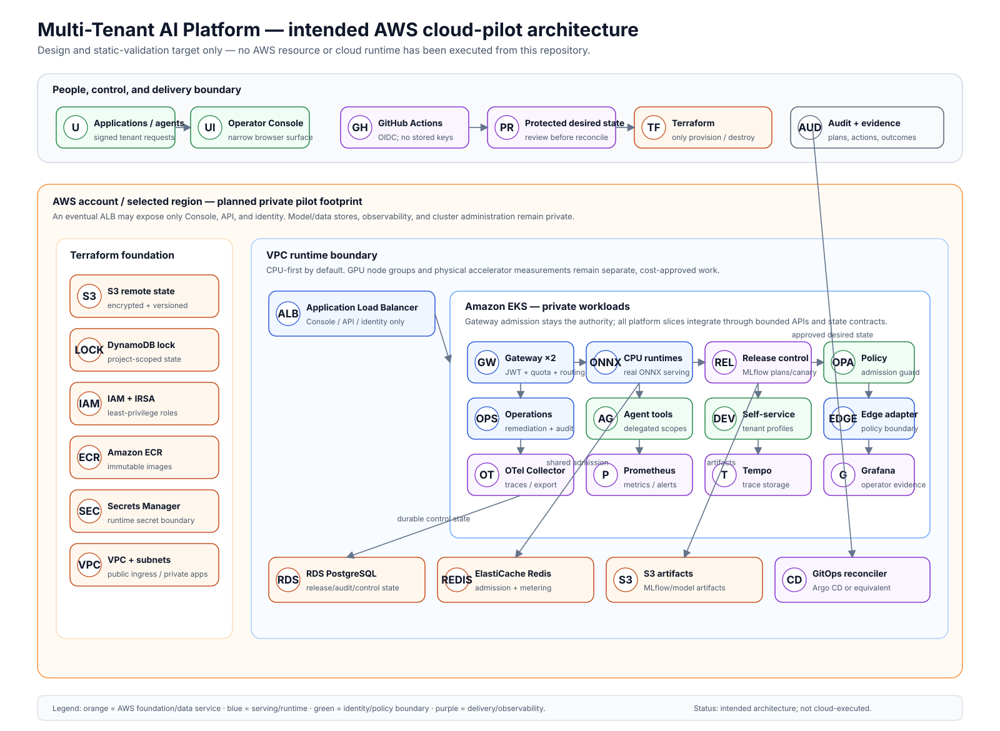

# Planned AWS Cloud Architecture

This document explains the cloud pilot we would create with Terraform. It is **not**
evidence that the platform has run in AWS. The repository has completed a real,
authenticated Terraform plan review only; no AWS resource was created.

## In simple terms

Teams call one gateway instead of being handed direct access to models, Redis,
Kubernetes, or AWS. The gateway checks identity and tenant, applies fair-use limits,
chooses an approved model route, and records safe operational evidence.

Terraform would create the AWS foundation. EKS would run platform services in private
subnets. RDS would keep durable records. Redis would share admission limits. ECR and
S3 would hold images and model artifacts. Secrets Manager and IAM roles would provide
only the credentials each workload needs.

## What stays private

Only a future operator Console/API/identity route may be exposed for browser review.
The following remain private: Redis, RDS, S3 artifacts, MLflow, Prometheus, Grafana,
Tempo, Kubernetes APIs, and secret stores. A browser never receives AWS, Kubernetes,
Redis, or model-runtime credentials.

## Planned AWS parts

| Part | Why it exists | Evidence today |
| --- | --- | --- |
| S3 + DynamoDB | Encrypted, versioned Terraform state and locking for this repository | Authenticated no-apply plan reviewed |
| VPC + EKS | Private CPU-first application runtime | Authenticated no-apply plan reviewed |
| ECR | Immutable container images | Authenticated no-apply plan reviewed |
| RDS PostgreSQL | Durable release, remediation, and audit records | Authenticated no-apply plan reviewed |
| ElastiCache Redis | Shared tenant limits, routing, and safe usage state | Authenticated no-apply plan reviewed |
| S3 artifacts | Model and MLflow artifacts | Authenticated no-apply plan reviewed |
| IAM/IRSA + Secrets Manager | Narrow workload access without committed credentials | Authenticated no-apply plan reviewed |
| GitHub OIDC + GitOps | Short-lived delivery access and reviewed deployment changes | Code/configuration only |
| ALB | Narrow browser route only, if an AWS pilot needs it | Code/configuration only |

## Important limits

- CPU ONNX inference is real locally. It is not a cloud throughput or GPU benchmark.
- Simulated capacity is not a physical GPU scheduler.
- Terraform is the only allowed cloud create/destroy tool. Do not make ad-hoc console changes.
- A future GitHub workflow must use short-lived OpenID Connect (OIDC) credentials,
  not stored AWS keys.

See the [cloud-pilot runbook](cloud-pilot-runbook.md) for the exact future sequence
and [security and privacy](security/security.md) for the trust boundary.
