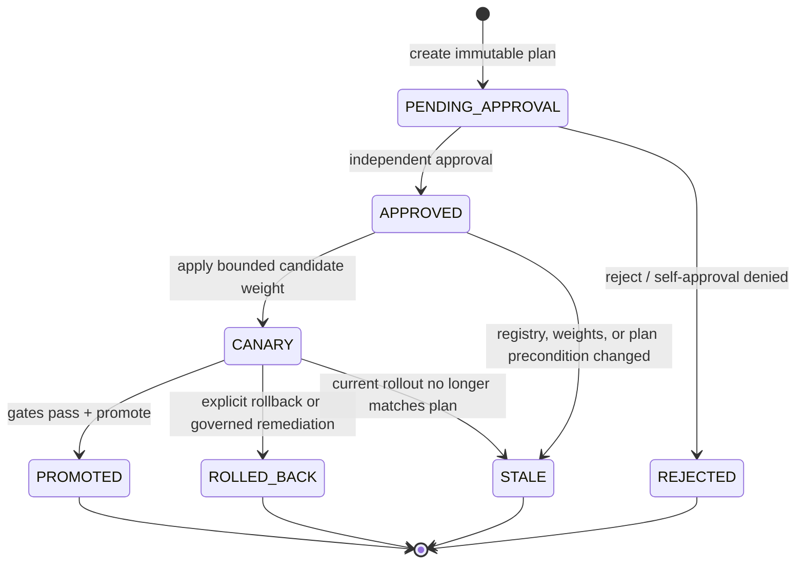

# Model rollouts

## In simple terms

A new model does not become the default model just because its container is healthy.
This platform records exactly which artifact is being considered, checks the release
plan, requires a different person to approve it, sends only limited traffic to it,
then either promotes it or restores the previous working model.

Flagship context: the existing weighted-routing core is preserved. A local MLflow
registry now stores real stable/candidate ONNX artifacts, SHA-256 digest tags, CPU
fixture evaluation metrics, and `champion`/`candidate` aliases. Release control binds
those identifiers into a SQLite plan, denies self-approval, uses a separate
`release.approve` role, writes canary intent to Redis for both gateways, promotes the
MLflow champion alias, and restores the recorded prior champion on rollback.

Model v1 is stable and v2 candidate. Progress 5→25→50→100% only after infrastructure health and workload-specific latency/error gates. Rollback changes target weights to zero; it does not claim model quality validation. Quality evaluation belongs to a separate curated evaluation pipeline.

`PUT /platform/v1/rollouts/{alias}` requires the platform-admin role, validates a complete 100% target allocation, refuses unhealthy targets, and records a metadata-only administrative audit event. It is a local control-plane implementation; production persists this event and deploys weights through protected GitOps state.

## Executed artifact and release contract

The local registry contract is intentionally small and evidence-bearing:

| Field | Local behavior |
| --- | --- |
| model alias | `local-tiny-intent-classifier` |
| versions | stable v1 and candidate v2 ONNX fixture artifacts |
| registry | local MLflow server |
| integrity | SHA-256 digest recorded and rechecked before release actions |
| aliases | MLflow `champion` and `candidate` |
| evaluation | deterministic CPU fixture metrics; not quality proof for a real model |
| release plan | SQLite record binding alias, versions, digests, target weights, requester, and state |
| approval | separate `release.approve` identity; requester self-approval denied |
| online evidence | real routed CPU requests, local latency/error gates, trace context |
| rollback target | recorded prior champion and stable-only Redis rollout weights |

The local artifact is safe ONNX fixture content, not an arbitrary Python pickle. A
digest mismatch is rejected; a release is not considered valid because a model service
happens to return HTTP 200.

## Release state machine

The gateway reads shared rollout weights. Release control, not the browser or a tenant,
is the authority that transitions the plan. The local flow proves version, digest,
approval, canary, promotion, stale-state rejection, and stable rollback; it does not
claim a production-quality evaluation pipeline or GitOps delivery.
