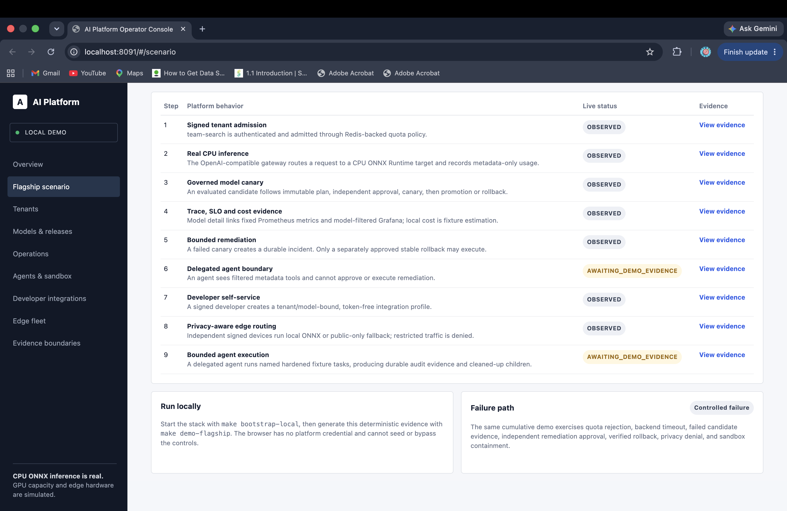
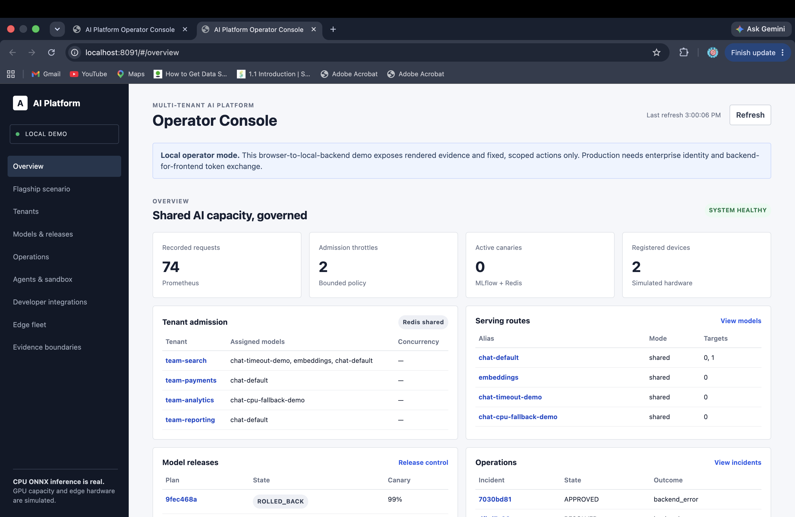
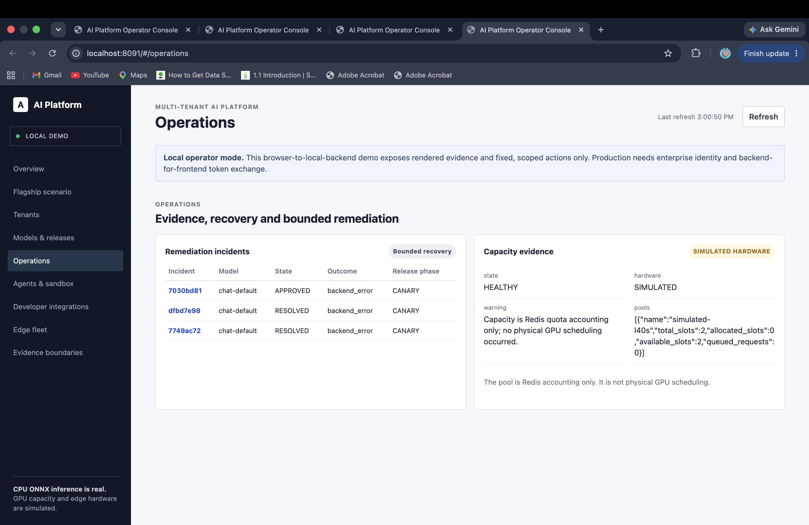

# Operator Console

The operator console is the unified local browser surface for the public flagship.
It is intentionally a restrained operations UI: dense tables, status chips, clear
evidence boundaries, and no simulated charts or invented AI analysis. It uses
hash-routed list and detail views rather than presenting every service as a separate
browser endpoint.

## Run it

```console
make install
make bootstrap-local
make demo-flagship
open http://localhost:8091
```

`make demo-operator-console` proves the console backend can retrieve routed tenant,
model, and delegated-agent evidence; create/approve/canary/rollback a release through
the existing release service; and invoke a named hardened sandbox fixture task. The
actions are forwarded to the existing services; their state machines and authorization
checks remain authoritative.

For a short controlled public walkthrough, use `make public-demo`. It runs the local
flagship scenario and creates a temporary Cloudflare Quick Tunnel, printing the public
console URL. The Quick Tunnel has no named-tunnel credentials and is not a deployment
mechanism; anyone with its URL can reach this local demo, so stop it with `Ctrl-C` when
the walkthrough ends. The local platform remains running until `make clean-local`.

## Captured local views

The following are unedited screenshots captured from the running local console on
2026-09-30. Counts, plan IDs, and active states are runtime evidence and naturally vary
between clean-room runs; the screenshots are not mockups or production screenshots.

### Flagship scenario



### Cross-slice overview



### Operations and bounded recovery



## What it shows

- overview: tenant admission and Prometheus request/throttle totals;
- tenant pages: assigned models, admission limits, and metadata-only usage evidence;
- model and release pages: serving targets, rollout audit context, MLflow registry
  evidence, immutable plans, and the eligible next release action. Model detail pages
  also query fixed Prometheus metrics for request volume/outcomes, p95 latency, p95
  time-to-first-token, tokens, estimated fixture cost, SLO evidence, and release
  phase. They link to the same model-filtered Grafana dashboard for deeper analysis;
- operations pages: remediation incident state, timeline, and Redis-backed simulated
  capacity (**not physical GPU state**);
- agent and sandbox pages: filtered tool audit, task outcome, and hardening metadata;
- developer profile pages: tenant-bound profile metadata and token-free generated files;
- edge pages: independent simulated device-agent inventory and explicit hardware boundary.

## Guided local workflows

The console is not only a status page. It provides narrowly scoped workflow controls
that call the services which already own the relevant authorization and state machine:

- **Models & releases:** choose a small canary percentage, then follow the existing
  evaluation → independent approval → canary → promote or rollback transitions.
- **Operations:** create only the pre-defined canary rollback plan for an eligible
  incident, then forward independent approval and bounded execution to remediation
  control. No arbitrary remediation, shell command, Kubernetes action, or URL can be
  entered in the UI.
- **Developer integrations:** create a tenant-bound, token-free starter profile. The
  downstream self-service API still checks model assignment and persists the profile.
- **Agents & sandbox:** view delegated permissions and invoke only the named patch or
  containment fixture tasks; arbitrary task input remains unavailable.
- **Edge fleet:** toggle online/offline only for the two known local fixture agents.
  This is explicitly a simulated network input, never a physical device control.

The overview has browser-session activity for operator orientation. It is not an audit
system; durable audit remains in each owning service and is visible through the linked
detail views.

Every list row links to its scoped detail route, for example
`#/tenant/team-search`, `#/model/chat-default`, or `#/incident/<id>`. The console
has no generic browser proxy, arbitrary PromQL interface, arbitrary command/action
form, arbitrary URL target, or browser-held platform token. The browser asks only for
fixed, server-defined views and actions.

## Presentation principles

The console and its documentation deliberately use a restrained operations style:

- dense, legible tables and status labels over decorative charts;
- explicit “local,” “simulated,” and “not claimed” labels at the point of evidence;
- links to durable records and real observability rather than synthetic AI summaries;
- fixed, least-privilege actions rather than free-form administrative controls.

Do not add gradients, invented utilization visuals, fabricated performance numbers, or
screenshots that were not captured from a running application.

## Local security boundary

The browser receives no platform JWT, Redis credential, Docker credential, or model
runtime credential. The console service reads ignored synthetic tokens generated by
`bootstrap-local` and uses them only to call the local Compose services. This makes the
demo practical, but it is **not a production user-authentication design**. The normal
console binding is localhost. The only exception documented here is a short,
operator-controlled `make public-demo` Quick Tunnel walkthrough; it is public, has no
enterprise authentication, and must be stopped immediately after the demonstration.

For production, replace synthetic tokens with enterprise OIDC, session/CSRF protection,
per-user policy evaluation, independently auditable approval identities, and a
least-privilege backend-for-frontend exchange. The console does not weaken the existing
release self-approval rule or make the sandbox arbitrary-code execution.
