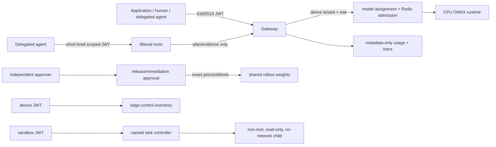

# Security and privacy

Flagship context: remediation, agent-tool, developer-self-service, and narrow edge
adapters are executed locally; each extends—not bypasses—the existing signed identity,
tenant authorization and privacy boundary.

The gateway authenticates before resolving tenant and fails closed for unknown credentials/models. It does not trust tenant headers or expose Kubernetes/GPU credentials. Kubernetes templates use non-root, read-only root filesystem, dropped capabilities, seccomp, NetworkPolicy, ServiceAccount, limits, and secret references. Model registry tokens belong in external secrets, never Git.

Prompts/responses are sensitive and are not logged or metered as content. Retain metadata only, minimize access, define controlled debugging opt-in with retention/audit, and protect traces/logs accordingly.

The remediation controller has a deliberately smaller authority boundary than the
gateway. It reads an existing metadata-only request record, accepts only a failed
canary request, and can execute only `ROLLBACK_CANARY_TO_STABLE`. It requires a signed
`platform.admin` requester plus a different signed `remediation.approve` principal;
the requester cannot self-approve. The exact release plan and weights are preconditions
checked immediately before execution. Stale state is rejected, while cooldown and
action-budget guards prevent retry loops. The controller has no generic shell,
Kubernetes, Docker, cloud, registry, or tenant-inference credential.

The developer-self-service service is also deliberately bounded. It validates the
same signed JWT issuer/audience/expiry/signature controls as the gateway, derives the
tenant server-side, requires `developer.self_service`, and rejects delegated agent
principals. It accepts only tenant-assigned aliases, isolates profile reads by tenant,
and makes repeated calls safe through tenant-scoped idempotency fingerprints. Generated
starter files contain no bearer token or tenant override header; the local demo supplies
an already-issued fixture token only at client execution time. Production identity/token
issuance remains an external identity-provider adapter.

The edge adapter has a separate identity class. Its device tokens contain
`principal_type=device` and `edge.connect`; a human/tenant token cannot register a
device, while a device token cannot call platform administration, release, or
remediation APIs. The device agent validates the original signed tenant token before
inference and evaluates privacy before any central fallback. Its control-plane SQLite
registry stores device/profile/model/network/telemetry metadata—not inference inputs
or outputs. Profiles are simulation inputs, not attestation or physical hardware proof.

The sandbox controller is explicitly a trusted local control component: it alone has
Docker API access to create project-labelled child containers. A signed delegated agent
has only `agent.sandbox` and `sandbox.execute`, a named human delegator, and a
five-minute expiry. It can select only a named task, never an arbitrary command/image/
network/mount. Every child uses non-root UID 65532, read-only root filesystem, dropped
Linux capabilities, no-new-privileges, CPU/memory/PID limits, `network=none`, no
Docker socket, and no host bind mount. Task records retain metadata and patch hashes,
not workspace contents. This does not claim gVisor, Firecracker, or Kubernetes sandbox
execution.

## Security architecture

No browser, tenant client, delegated agent, device, or sandbox child receives a Redis,
Docker, MLflow, Kubernetes, cloud, or platform-administrator credential. The local
operator console is a server-side fixture-token BFF for a Compose demo, not an
enterprise SSO implementation.

## Threat model and controls

| Threat | Executed local control | Boundary / remaining limit |
| --- | --- | --- |
| forged, expired, wrong-audience token | Ed25519 signature, issuer, audience, expiry, tenant, and role checks | production OIDC/JWKS remains an adapter |
| client claims another tenant | tenant is derived from JWT; cross-tenant tests deny reads/actions | no external identity federation executed |
| one tenant overloads shared inference | Redis Lua request/token/concurrency/bounded-queue limits across two gateways | no real GPU scheduler evidence |
| unsafe model promotion | immutable digest-bound plan, independent approval, stale-state recheck, rollback | evaluation fixture is not production quality validation |
| agent privilege escalation | filtered tool discovery, scope checks, plan-only tool, durable hashed audit | this slice is HTTP, not MCP protocol execution |
| agent code task exfiltration | named tasks only; child no network, Docker socket, host mounts, root privileges | gVisor/Firecracker not executed |
| privacy-sensitive edge fallback | restricted/`LOCAL_ONLY` request denied when local model unavailable | device properties are simulated profiles |
| remediation loop or stale rollback | allowlisted action, cooldown/action budget, distinct approver, exact rollout recheck | no live Kubernetes remediation here |
| prompt/response disclosure in telemetry | metadata-only usage and audit; no raw prompt/output by default | production retention/SIEM controls are roadmap |

Report security concerns through the repository's security process. Never paste a
token, private key, customer prompt, or exploit payload into a public issue.
